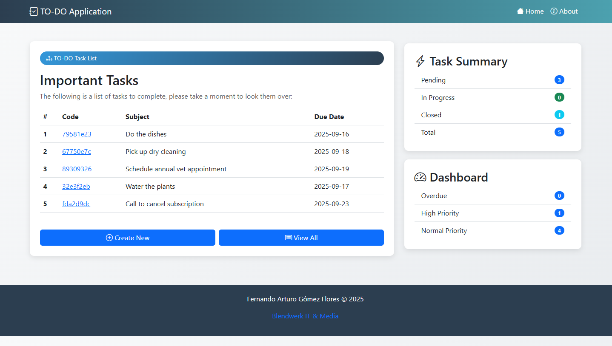
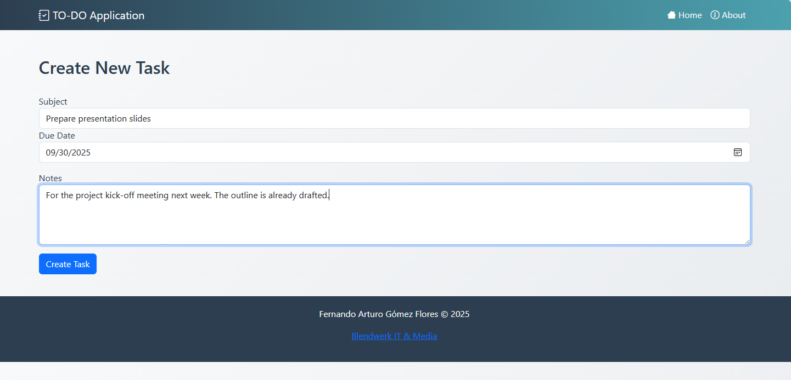
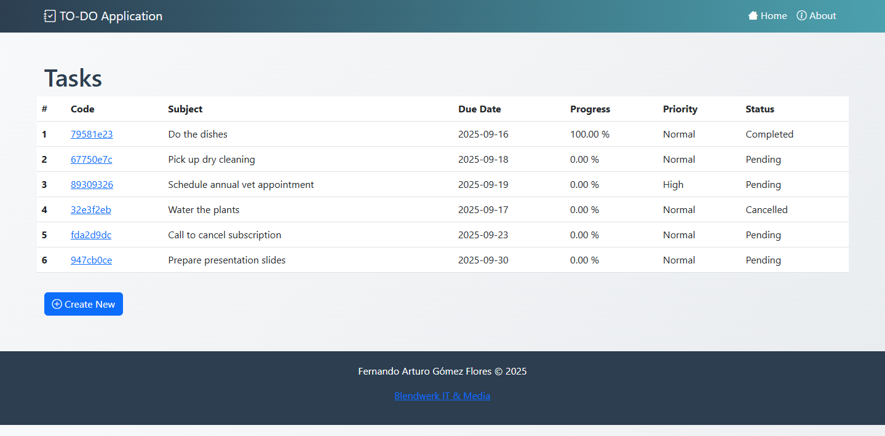
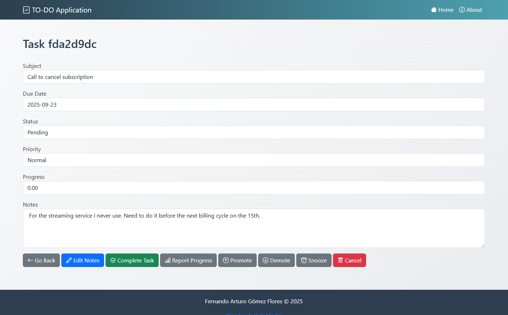

# TO-DO Application in Python

A Python application to manage a to-do list. This project is part of my learning path for the language.

## Features

The first release of this application was a command-line app, now it's a full-blown web application using Flask. This is how the home page looks like.

In general, the application provides the following functionality:
* Add a new task
* Update the content of an existing task.
* View existing tasks in a table view.
* View the detail of a task,
* Track a task's progress (from 0% to 100%).
* Promote or demote a task's priority.
* Automatic state management:
    - 0% - _Pending_
    - 100% - _Completed_
    - Any intermediate value - _In Progress_
* Cancel a task that's no longer needed.

You can create a new task and enter the subject and a note, as well as selecting the due date. 

You can also look at all the tasks that have been created yet. 

Clicking the _Create New_ button will navigate you to the _Create Task_ screen. Clicking the code link for each task will navigate you to the _Task Detail_ page. 

From here, you can perform several activities and issue the following commands:

| Command       | Description |
|------------   |------------|
| **Go Back** | Navigates to the All Tasks view. |
| **Edit Notes** | Modify an existing task by changing the subject or the notes. |
| **Complete Task**    | Marks a task as completed (i.e. progress is changed to 100% and status to Completed). |
| **Report Progress**  | Report changes to a task's progress; use 0 to mark it as pending and 100 to mark it as completed. |
| **Promote**   | Increase a task's priority: from low to normal, or from normal to high. |
| **Demote**    | Decrease a task's priority: from high to normal, or from normal to low. |
| **Snooze**     | Changes the due date for a specific amount of time. |
| **Cancel**      | Marks the task as cancelled and cannot issue any new command. |

## Technical details

### Dependencies

The application is built and tested with Python 3.13. It uses the following packages:

* Flask - framework used to run the web application. 
* SQLAlchemy - O/RM used to map python objects into SQLite 3 tables. 
* Flask-WTF - forms for creating view models in the Flask web application.
Flask-SQLAlchemy - package that integrates SQLAlchemy with Flask.

**Install dependencies**:

    pip install flask
    
    pip install flask-wtf

    pip install flask-sqlalchemy

**Run the application**:

    python main.py

### Database

The application stores all data in a local SQLite 3 database file named "todo.db". Data is loaded and saved through the use of SQLAlchemy.

The database schema is:

    CREATE TABLE tasks (
        id UUID NOT NULL, 
        code VARCHAR(50) NOT NULL, 
        subject VARCHAR(100) NOT NULL, 
        due_date DATETIME NOT NULL, 
        status INTEGER NOT NULL, 
        priority INTEGER NOT NULL, 
        progress FLOAT NOT NULL, 
        notes VARCHAR(1000), 
        PRIMARY KEY (id), 
        UNIQUE (id), 
        UNIQUE (code)
    )

If the database file does not exist, the application will recreate it automatically.

### Architecture

The application follows a layered architecture. It implements a very basic domain-driven design, as well as a separation between commands (represented by the controller classes) and the queries themselves (command-query responsibility segregation). The layers are as follows:

* Domain - contains common packages for supporting domain driven design, as well as the only bound context for our app: tasks. This module, in turn, contains our only aggregate root, Task, which validates and enforces the business invariants.
* Infrastructure - contains packages related to interacting with the database, the data model (e.g. the O/RM objects that are actually mapped to the SQLite 3 database, without any validation), the repositories (load data and build the domain objects), and the queries (directly interact with the database for read-only purposes, by-passing the domain objects.)
* Application - contains packages related to the application services, like the controllers (which issue commands) and viewmodels (which perform user input validations), as well as the integration with the Flask framework. 

### User experience

The application uses Bootstrap 5 to layer out the UI elements in the web page. Please note that I generated the Bootstrap theme using DeepSeek, as I'm not a graphical designer nor do I have an iota of visual intelligence or even good taste.

## Versions

v0.2 web app release: the applicaton was turned from a command line app into a full-blown web application. 
v0.1 First release: the entire application lives in a single file using only functions. A future refactor to classes and a more structured design may be considered.
